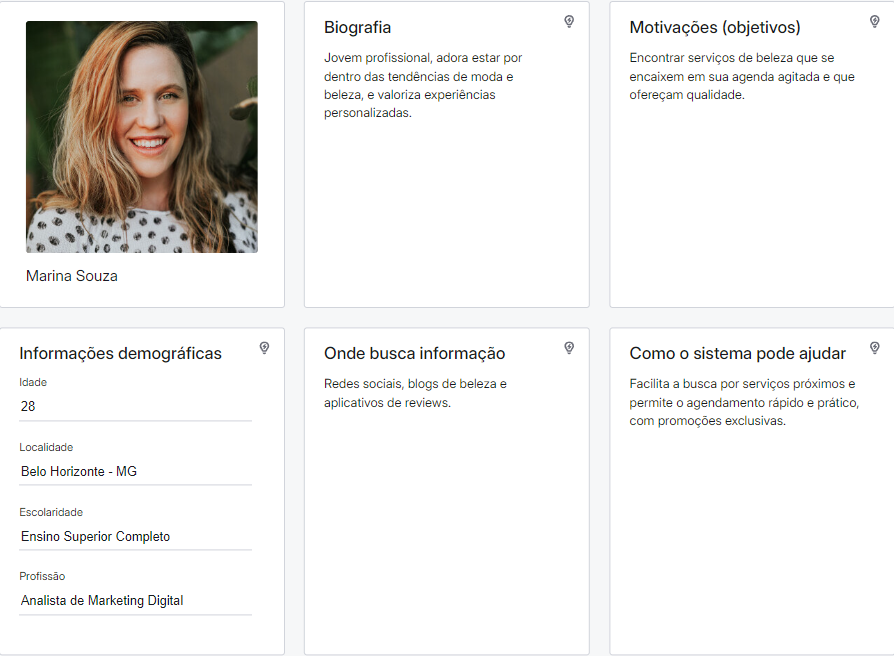
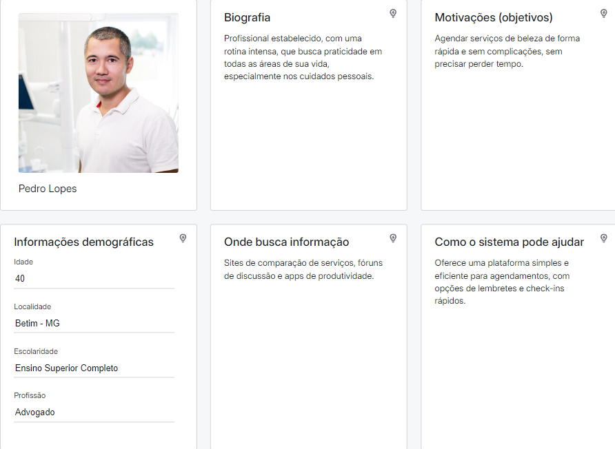
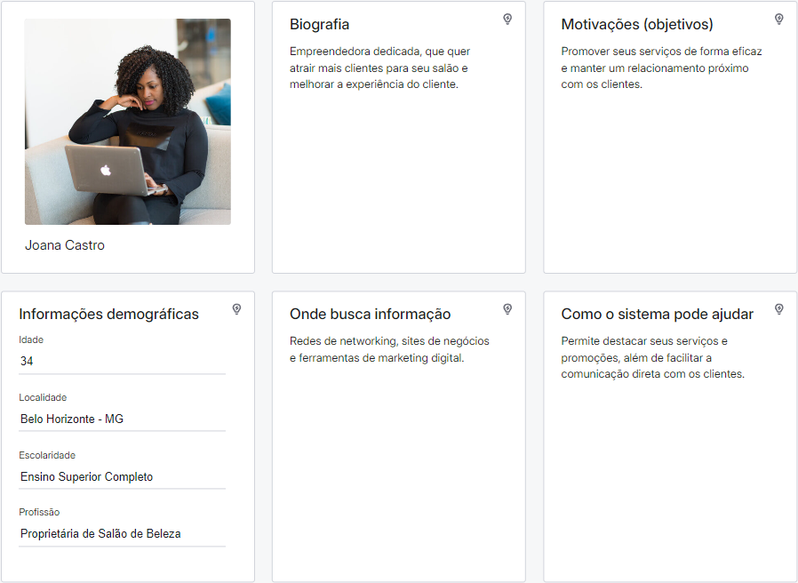
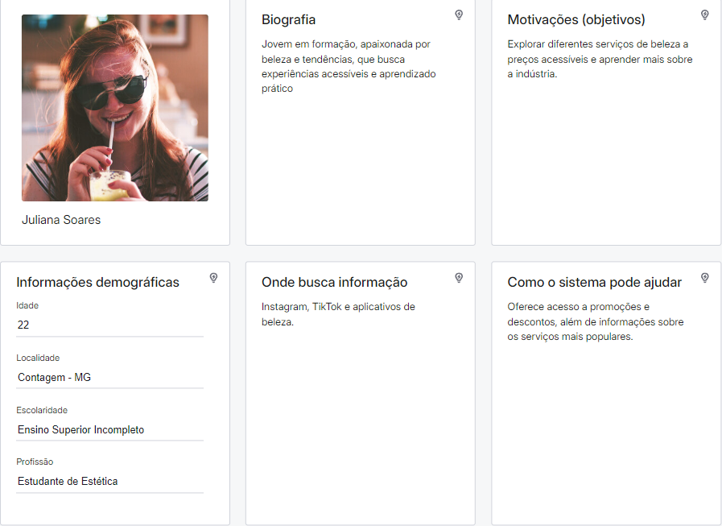

# Introdução

Texto descritivo com a visão geral do projeto abordado. Inclui o contexto, o problema, os objetivos, a justificativa e o público-alvo do projeto.

## Problema
Nesse momento você deve apresentar o problema que a sua aplicação deve  resolver. No entanto, não é a hora de comentar sobre a aplicação.

Descreva também o contexto em que essa aplicação será usada, se  houver: empresa, tecnologias, etc. Novamente, descreva apenas o que de  fato existir, pois ainda não é a hora de apresentar requisitos  detalhados ou projetos.

Nesse momento, o grupo pode optar por fazer uso  de ferramentas como Design Thinking, que permite um olhar de ponta a ponta para o problema.

> **Links Úteis**:
> - [Objetivos, Problema de pesquisa e Justificativa](https://medium.com/@versioparole/objetivos-problema-de-pesquisa-e-justificativa-c98c8233b9c3)
> - [Matriz Certezas, Suposições e Dúvidas](https://medium.com/educa%C3%A7%C3%A3o-fora-da-caixa/matriz-certezas-suposi%C3%A7%C3%B5es-e-d%C3%BAvidas-fa2263633655)
> - [Brainstorming](https://www.euax.com.br/2018/09/brainstorming/)

## Objetivos

Objetivo geral: o projeto tem como objetivo estreitar ao máximo a relação entre clientes e estabelecimentos comerciais que prestem serviços de beleza pessoal.
Delimitação: iremos nos focar apenas em serviços de beleza.

O objetivo da criação da aplicação é a ideia de maximizar o contato entre clientes e salões. Com a ideia, pretendemos implementar um modo onde cada usuário final possa escolher o melhor serviço e local, com uma pesquisa mais simples e limpa. Ofereceremos praticidade, segurança, conforto, otimização, flexibilidade e modernidade, tanto aos salões, quanto aos clientes.

Nossa principal pesquisa será feita em cima de usuários finais da aplicação: da parte do cliente, iremos atrás de definir quais as melhores funcionalidades para facilitar o uso; da parte do salão, iremos investigar a melhor forma de mostrar todos os serviços oferecidos.

## Justificativa

A justificativa se baseia na possibilidade de facilitar e diminuir a rotina dos usuários de serviço de beleza, dispensando grandes pesquisas como área, endereço e serviços prestados.
Queremos alcançar a máxima de agilidade e flexibilidade dos usuários finais, tornando assim a aplicação uma ferramenta aliada poderosa para o dia-a-dia dos salões e recorrente no cliente.
Vamos optar por um trabalho investigativo com analises de sites de buscas confiáveis e de opinião de usuários do serviço prestado.

> **Links Úteis**:
> - [Como montar a justificativa](https://guiadamonografia.com.br/como-montar-justificativa-do-tcc/)

## Público-Alvo

O aplicativo "Gestão de Salão" é direcionado a adultos conectados, tanto homens quanto mulheres, que buscam conveniência e qualidade em seus cuidados pessoais. Esse público valoriza a praticidade e a modernidade, preferindo soluções tecnológicas que otimizem seu tempo e facilitem o acesso a serviços de beleza. Inclui tanto clientes frequentes de salões, que desejam um relacionamento contínuo e vantajoso com seus estabelecimentos preferidos, quanto novos clientes em busca de opções confiáveis e acessíveis na área de beleza.

## Personas 
Para entender melhor os perfis dos usuários que o nosso sistema busca atender, desenvolvemos personas representativas das principais categorias dentro do público-alvo, conforme apresentado a seguir.

## Histórias de Usuários

Com base na análise das personas foram identificadas as seguintes histórias de usuários:

|EU COMO... `PERSONA`| QUERO/PRECISO ... `FUNCIONALIDADE` |PARA ... `MOTIVO/VALOR`                 |
|--------------------|------------------------------------|----------------------------------------|
|Marina Souza        | Agendar serviços de beleza próximos e rapidamente          | Conseguir encaixar cuidados pessoais na minha agenda sem complicações                              |
|Pedro Lopes         | Agendar serviços de beleza de forma prática e eficiente    | Economizar tempo e garantir que meus cuidados pessoais estejam sempre em dia                     |
|Joana Castro        | Promover meus serviços e atrair novos clientes pelo app    | Aumentar a visibilidade  do salão e fortalecer o relacionamento com os clientes                |
|Juliana Soares      | Explorar diferentes serviços de beleza e acessar promoções | Aprender mais sobre a indústria e aproveitar ofertas que cabem no meu orçamento               |

 
# Especificações do Projeto

## Requisitos

As tabelas que se seguem apresentam os requisitos funcionais e não funcionais que detalham o escopo do projeto. Para determinar a prioridade de requisitos, aplicar uma técnica de priorização de requisitos e detalhar como a técnica foi aplicada.

### Requisitos Funcionais

|ID    | Descrição do Requisito  | Tipo |  Prioridade |
|------|-------------------------|----------------|----|
|RF-001| O sistema deve exibir uma tela para login/cadastro/(talvez: Recuperar senha? Caso implementemos, criar os RFs para recuperar senha e modificar o flowchart...) | TELA DE LOGIN - Seleção do Tipo de Usuário | ALTA |
|RF-002| O sistema deve exibir uma opção para o usuário selecionar o que deseja fazer: login ou cadastro | TELA DE LOGIN - Seleção do Login | ALTA |
|RF-003| O sistema deve permitir que o usuário final se auto cadastre com dados como: Email, senha, telefone, CPF. | TELA DE LOGIN - Cadastro de Usuário | ALTA |
|RF-004| O sistema deve permitir que o usuário final e/ou funcionário entrem com o seu CPF, senha e um checkbox "Sou Funcionário?". | TELA DE LOGIN - Entrada de Credenciais existentes | ALTA |
|RF-005| O sistema deve exibir um botão para visualizar/ocultar a senha digitada tanto na tela de login como na tela de cadastro. | TELA DE LOGIN - Entrada de Credenciais existentes | ALTA |
|RF-006| O cadastro de um novo funcionário/profissional só pode ser realizado após o login de um funcionário autorizado da empresa. Usuário padrão = Admin (criado na hora da implementação do sistema no salão). | APÓS LOGIN - Login de Admin | ALTA |
|RF-007| O sistema deve exigir que o Amd autorizado insira os seguintes dados ao cadastrar um novo funcionário/profissional: nome completo do funcionário, e-mail corporativo do funcionário, CPF, telefone, cargo ou especialidade, e CNPJ da empresa. | Cadastro de Colaborador - Cadastro de Novo Funcionário Após Login de Funcionário Autorizado | ALTA |
|RF-008| O sistema deve permitir que o usuário (qualquer tipo) configure seu perfil com mais dados, ou troque sua senha. | TELA DE LOGIN - Cadastro de Novo Funcionário Após Login de Funcionário Autorizado | ALTA |
|RF-009| O sistema deve permitir que o Adm crie, edite e exclua compromissos na agenda geral. | APÓS LOGIN - Gestão de Agendas | ALTA |
|RF-010| O sistema deve permitir que o funcionário/profissional crie, edite e exclua compromissos em sua agenda pessoal. | APÓS LOGIN - Gestão de Agendas para funcionário | ALTA |
|RF-011| O sistema deve permitir que o funcionário/profissional defina a disponibilidade em sua agenda, indicando horários livres e ocupados. | APÓS LOGIN - Gestão de Agendas para funcionário | ALTA |
|RF-012| O sistema deve garantir que apenas o funcionário/profissional autenticado tenha acesso à sua agenda específica, sem visibilidade das agendas de outros profissionais, exceto pela empresa administradora. | APÓS LOGIN - Gestão de Agendas para funcionário | ALTA |
|RF-013| O sistema deve permitir que o funcionário/profissional visualize e gerencie reservas feitas por usuários finais diretamente em sua agenda | APÓS LOGIN - Gestão de Agendas para funcionário | ALTA |
|RF-014| O sistema deve assegurar que cada funcionário/profissional só possa visualizar e editar a sua própria agenda, sem acesso às agendas de outros profissionais ou à agenda corporativa. | APÓS LOGIN - Controle de Acesso à Agenda para funcionário | ALTA |
|RF-015| O sistema deve enviar notificações por e-mail ou WhatsApp para o funcionário/profissional quando um novo compromisso é agendado ou cancelado por um usuário final. | APÓS LOGIN - Notificações para funcionário | BAIXA |
|RF-016| O sistema deve garantir que o acesso a funcionalidades específicas da aplicação seja concedido com base no tipo de usuário (Usuário Final, Empresa ou Funcionário/Profissional). O sistema deve redirecionar o funcionário/profissional para a tela da agenda pessoal após o login.| APÓS LOGIN - Controle de Acesso | ALTA |
|RF-017| O sistema deve redirecionar o usuário final para a tela inicial apropriada após o login (ex.: LISTA DE SALÕES NO RAIO DE 20 KM). | APÓS LOGIN - Redirecionamento Pós-Login | ALTA |
|RF-018| O sistema deve redirecionar a empresa para a tela inicial corporativa após o login (ex.: painel administrativo da empresa). | APÓS LOGIN - Redirecionamento Pós-Login | ALTA |
|RF-019| O sistema deve fornecer uma opção visível para logout em todas as telas pós-login. O sistema deve garantir que o logout encerre completamente a sessão do usuário, exigindo novo login para acessar a aplicação novamente. | LOGOUT | ALTA |
|RF-020| O sistema deve exibir mensagens claras e específicas para erros de login, como "Senha incorreta" ou "E-mail não registrado". | LOGIN - Feedback de Erro | ALTA |
|RF-021| O sistema deve alertar o usuário em caso de tentativa de acesso com uma conta incorreta para o tipo de usuário selecionado. | LOGIN - Feedback de Erro | ALTA |
|RF-022| O sistema deve bloquear a conta após um número específico de tentativas de login falhas e fornecer instruções para desbloqueio. | APÓS LOGIN - Controle de Acesso | BAIXA |
|RF-023| O sistema deve solicitar permissão para acessar a localização atual do usuário ao abrir a tela, ao abrir o app. | ESCOLHA DO SALÃO - Geolocalização | MEDIA |
|RF-024| O sistema deve obter as coordenadas GPS do usuário e utilizá-las para calcular a distância até os salões de beleza próximos. | ESCOLHA DO SALÃO - Geolocalização | MEDIA |
|RF-025| O sistema deve permitir que o usuário insira manualmente um endereço ou CEP, caso não deseje utilizar a localização atual. | ESCOLHA DO SALÃO - Geolocalização | MEDIA |
|RF-026| O sistema deve exibir uma lista de salões de beleza dentro de um raio de 20 quilômetros da localização do usuário. | ESCOLHA DO SALÃO - Listagem de Salões de Beleza | MEDIA |
|RF-027| O sistema deve exibir o nome, endereço, e a distância de cada salão de beleza em relação à localização atual do usuário. | ESCOLHA DO SALÃO - Listagem de Salões de Beleza | MEDIA |
|RF-028| O sistema deve exibir uma imagem representativa do salão de beleza, como uma foto da fachada/interior/logo. | ESCOLHA DO SALÃO - Listagem de Salões de Beleza | MEDIA |
|RF-029| O sistema deve permitir que o usuário visualize a lista de salões em ordem crescente de distância. | ESCOLHA DO SALÃO - Listagem de Salões de Beleza | MEDIA |
|RF-030| O sistema deve permitir que o usuário aplique filtros para refinar a lista de salões de beleza com base em critérios como: Serviços oferecidos (ex.: corte, manicure, coloração), Faixa de preço (ex.: econômico, intermediário, premium), Classificação (ex.: salões com avaliação mínima de 4 estrelas), Disponibilidade de horários | ESCOLHA DO SALÃO - Filtros de Pesquisa | ALTA |
|RF-031| O sistema deve permitir que o usuário clique em um salão de beleza na lista para ver uma página de detalhes. | ESCOLHA DO SALÃO - Detalhes do Salão | ALTA |
|RF-032| O sistema deve exibir uma lista de serviços disponíveis no salão de beleza escolhido. | ESCOLHA DO SERVIÇO - Exibição de Serviços do Salão de Beleza | ALTA |
|RF-033| O sistema deve mostrar para cada serviço: nome, descrição breve, preço e duração estimada. | ESCOLHA DO SERVIÇO - Detalhes do Serviços | ALTA |
|RF-034| O sistema deve permitir que o usuário selecione um ou mais serviços para obter mais detalhes ou adicionar ao carrinho. | ESCOLHA DO SERVIÇO - Detalhes do Serviços | ALTA |
|RF-035| O sistema deve categorizar os serviços por tipos (ex.: Cabelo, Unhas, Maquiagem, etc.) | ESCOLHA DO SERVIÇO - Detalhes do Serviços | ALTA |
|RF-036| O sistema deve permitir que o usuário clique em qualquer serviço para visualizar detalhes adicionais, incluindo fotos, avaliações e profissionais disponíveis. | ESCOLHA DO SERVIÇO - Detalhes e Seleção de Serviços | ALTA |
|RF-037| O sistema deve permitir que o usuário escolha um profissional específico para cada serviço, exibindo uma lista de profissionais disponíveis com base em: Nome do profissional,	Foto do profissional,	Experiência e especializações,	Avaliações e comentários de outros clientes | ESCOLHA DO SERVIÇO - Detalhes e Seleção de Serviços | ALTA |
|RF-038| O sistema deve permitir que o usuário selecione o serviço desejado e adicione-o ao carrinho de compras somente após escolher e passar por todas as etapas de escolha (salao/serviço/profissional/data/hora). | ESCOLHA DO SERVIÇO - Detalhes e Seleção de Serviços | ALTA |
|RF-039| O sistema deve exibir a disponibilidade de horários para cada profissional selecionado antes de adicionar o serviço ao carrinho. | ESCOLHA DO SERVIÇO - Detalhes e Seleção de Serviços | ALTA |

|RF-052| O sistema deve exibir o carrinho de compras com todos os serviços adicionados, mostrando um resumo que inclui: Nome do serviço,	Nome do profissional selecionado,	Preço de cada serviço, Duração total estimada dos serviços | CARRINHO - Ordem de serviços | ALTA |
|RF-053| O sistema deve permitir que o usuário edite o carrinho, com opções para remover serviços, ajustar quantidades ou selecionar outro profissional. | CARRINHO - Ordem de serviços | ALTA |
|RF-054| O sistema deve exibir o total a pagar no carrinho, incluindo possíveis taxas ou descontos aplicados. | CARRINHO - Ordem de serviços | ALTA |
|RF-055| O sistema deve permitir que o usuário prossiga para o agendamento após revisar os serviços no carrinho. | AGENDA - Agendamento de Serviços | ALTA |
|RF-056| O sistema deve exibir as datas e horários disponíveis para cada serviço selecionado, de acordo com a disponibilidade do profissional escolhido. | AGENDA - Agendamento de Serviços | ALTA |
|RF-057| O sistema deve permitir que o usuário confirme o agendamento e visualize um resumo da reserva antes de finalizar. | AGENDA - Agendamento de Serviços | ALTA |
|RF-058| O sistema deve gerar automaticamente um QR code único após a confirmação do agendamento. | AGENDA - Geração de QR Code | ALTA |
|RF-059| O QR code deve conter informações básicas sobre o agendamento, como nome do usuário, data, hora, serviços agendados e os profissionais escolhidos. | AGENDA - Geração de QR Code | ALTA |
|RF-060| O sistema deve exibir o QR code na tela de confirmação do agendamento e enviar uma cópia via e-mail ou mensagem para o usuário. | AGENDA - Geração de QR Code | ALTA |
|RF-061| O sistema deve permitir que o salão de beleza utilize uma máquina ou celular com leitor de QR code para escanear o QR code do usuário na chegada. | AGENDA - Confirmação de Presença e Baixa do Serviço | ALTA |
|RF-062| O sistema deve reconhecer o QR code gerado anteriormente e verificar a validade do agendamento. | AGENDA - Confirmação de Presença e Baixa do Serviço | ALTA |
|RF-063| Após a leitura do QR code, o sistema deve registrar automaticamente a presença do usuário e atualizar o status do serviço como “realizado” no sistema do salão | AGENDA - Confirmação de Presença e Baixa do Serviço | ALTA |
|RF-064| O sistema deve notificar o usuário e o salão de beleza, confirmando que a presença foi registrada e o serviço baixado. | AGENDA - Confirmação de Presença e Baixa do Serviço | ALTA |
|RF-065| O sistema deve enviar um lembrete ao usuário via notificação ou e-mail próximo à data e horário agendados. | AGENDA - Notificações e Lembretes | BAIXA |
|RF-066| O sistema deve notificar o usuário se houver necessidade de alterações no agendamento ou cancelamento. | AGENDA - Notificações e Lembretes | BAIXA |
|RF-067| O sistema deve permitir que o usuário visualize e gerencie seus agendamentos futuros, incluindo a opção de cancelar. | AGENDA - Gerenciamento de Agendamentos | BAIXA |
|RF-068| O sistema deve permitir que o usuário acesse o QR code a qualquer momento a partir da seção de agendamentos. | AGENDA - Gerenciamento de Agendamentos | ALTA |
|RF-069| O sistema deve solicitar ao usuário uma avaliação do serviço após a confirmação da presença ou conclusão do atendimento. | FEEDBACK - Feedback e Avaliações | BAIXA |
|RF-070| O sistema deve permitir que o usuário deixe um comentário e atribua uma classificação para o serviço e para o profissional que o atendeu. | FEEDBACK - Feedback e Avaliações | BAIXA |
|RF-071| O sistema deve garantir que o QR code gerado seja único e seguro, evitando duplicações ou fraudes. | SEGURANÇA - Segurança e Privacidade | ALTA |
|RF-072| O sistema deve proteger os dados do usuário e do agendamento conforme as normas de privacidade aplicáveis. | SEGURANÇA - Feedback e Avaliações | ALTA |

### Requisitos não Funcionais

|ID     | Descrição do Requisito  |Prioridade |
|-------|-------------------------|----|
|RNF-001| O sistema deve ser responsivo para rodar em um dispositivos móvel | MÉDIA | 
|RNF-002| Deve processar requisições do usuário em no máximo 3s |  BAIXA | 

Com base nas Histórias de Usuário, enumere os requisitos da sua solução. Classifique esses requisitos em dois grupos:

- [Requisitos Funcionais
 (RF)](https://pt.wikipedia.org/wiki/Requisito_funcional):
 correspondem a uma funcionalidade que deve estar presente na
  plataforma (ex: cadastro de usuário).
- [Requisitos Não Funcionais
  (RNF)](https://pt.wikipedia.org/wiki/Requisito_n%C3%A3o_funcional):
  correspondem a uma característica técnica, seja de usabilidade,
  desempenho, confiabilidade, segurança ou outro (ex: suporte a
  dispositivos iOS e Android).
Lembre-se que cada requisito deve corresponder à uma e somente uma
característica alvo da sua solução. Além disso, certifique-se de que
todos os aspectos capturados nas Histórias de Usuário foram cobertos.

## Restrições

O projeto está restrito pelos itens apresentados na tabela a seguir.

|ID| Restrição                                             |
|--|-------------------------------------------------------|
|01| O projeto deverá ser entregue até o final do semestre |
|02| Deve ser desenvolvido uma aplicação web               |
|03| Deve ser desenvolvida uma aplicação mobile            |

# Catálogo de Serviços

## Serviços Cliente:
### Cadastro/Login:
- Características:

### Agendamentos:
- Características:
  
### Pagamento de serviços:
- Características:

## Serviços Salão
### Cadastro/Login:
- Características:
  
### Controle de agenda:
- Características:

# Arquitetura da Solução

Definição de como o software é estruturado em termos dos componentes que fazem parte da solução e do ambiente de hospedagem da aplicação.

## Tecnologias Utilizadas

Descreva aqui qual(is) tecnologias você vai usar para resolver o seu problema, ou seja, implementar a sua solução. Liste todas as tecnologias envolvidas, linguagens a serem utilizadas, serviços web, frameworks, bibliotecas, IDEs de desenvolvimento, e ferramentas.

Apresente também uma figura explicando como as tecnologias estão relacionadas ou como uma interação do usuário com o sistema vai ser conduzida, por onde ela passa até retornar uma resposta ao usuário.

## Hospedagem

Explique como a hospedagem e o lançamento da plataforma foi feita.

> **Links Úteis**:
>
> - [Website com GitHub Pages](https://pages.github.com/)
> - [Programação colaborativa com Repl.it](https://repl.it/)
> - [Getting Started with Heroku](https://devcenter.heroku.com/start)
> - [Publicando Seu Site No Heroku](http://pythonclub.com.br/publicando-seu-hello-world-no-heroku.html)
